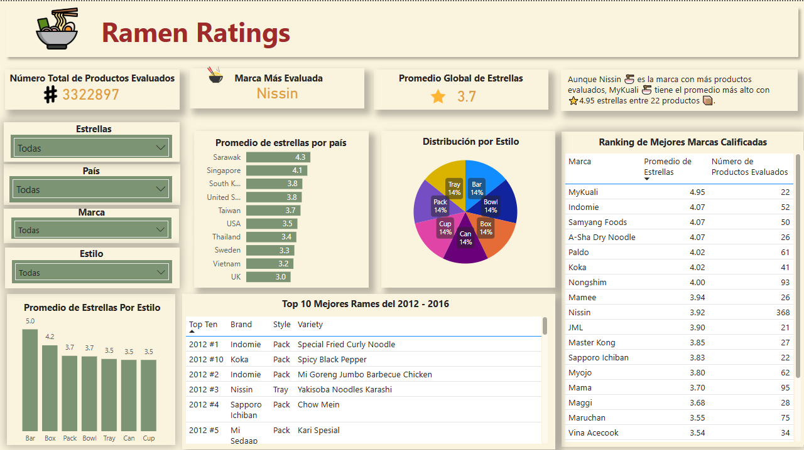

# 📊 Ramen Ratings
# Analisis de Ramen (Ramen Ratings Dashboard - Power BI)

Este proyecto presenta un dashboard interactivo basado en más de 2500 reseñas de productos de ramen a nivel internacional, recopiladas por [Aleksey Bilogur (Owner)](https://www.kaggle.com/datasets/residentmario/ramen-ratings).

---

## 📚 Tabla de Contenidos

- [🎯 Propósito](#-propósito)
- [📦 Conjunto de Datos](#-conjunto-de-datos)
- [🛠️ Tecnologías](#️-tecnologías)
- [📌 Vista previa del dashboard](#-vista-previa-del-dashboard)
- [💡 Insight clave](#-insight-clave)
- [📂 Archivos principales](#-archivos-principales)
- [🧠 Lecciones aprendidas](#-lecciones-aprendidas)
- [👤 Autor](#-autor)
- [📝 Licencia](#-licencia)

---

## 🎯 Propósito

Visualizar y analizar las calificaciones de ramen para identificar:
- Las marcas mejor calificadas
- El estilo de empaque con mejores evaluaciones
- Los países con mayores promedios de estrellas
- Productos destacados de 2012 a 2016

---

## 📦 Conjunto de Datos

El conjunto de datos utilizado contiene las siguientes columnas:

- `Review`: Id 
- `Brand (Marca)`: Nombre del Ramen
- `Variety (Variedad)`: Nombre del Ramen
- `Style (Estilo)`: Presentación
- `Country (País)`: País donde se prepara
- `Stars (Estrellas)`: Calidad del ramen (Escala de 5 puntos)
- `Top Ten (Los diez mejores)`: Columna con el Top 10 de los mejores ramens del 2012 - 2016

Fuente: [Nombre de la fuente o “datos simulados/ficticios”].

---

## 🛠️ Tecnologías

- **Power BI** – Visualización de datos
- **Microsoft Excel** – Limpieza de datos
- **DAX** – Cálculos de promedio y filtros
- **Kaggle** – Fuente del dataset original

---

## 📌 Vista previa del dashboard

## 💡 Insight clave

> Aunque **Nissin** es la marca con más productos evaluados (368), **MyKuali** es la mejor calificada con un promedio de ⭐ 4.95 estrellas entre 22 productos.

---

## 📂 Archivos principales

- [`ramen_dashboard.pdf`](reports/Dashboard_ramen_rantings.pdf): Visualización final en PDF
- [`ramen-ratings.xlsx`](data/processed/ramen_ratings_limpio.xlsx): Datos limpios para replicar el análisis

---

## 🧠 Lecciones aprendidas

- Cómo aplicar filtros efectivos (por volumen de productos) para evitar sesgos.
- Cómo destacar insights narrativos que expliquen el valor del análisis.
- Uso de Power BI para presentar dashboards listos para ejecutivos.

---

## 👤 Autor

**Said Mariano Sánchez** –  📧 *smariano170@gmail.com*  
*Analista de Datos Jr. | Visualización | Power BI | Python | SQL*  
🌎 México  
Este proyecto forma parte de mi portafolio como analista de datos Jr.

---

## 📝 Licencia

Este proyecto está licenciado bajo la **Licencia MIT**. Puedes usarlo, modificarlo y distribuirlo libremente, siempre que menciones al autor original.

---